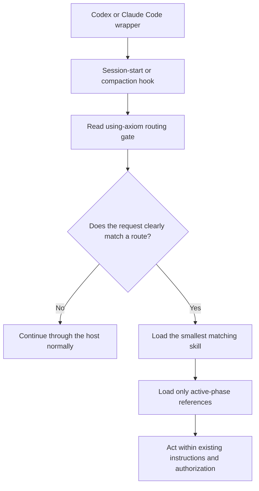

# Architecture

Axiom is a foreground routing layer made of checked-in plugin metadata,
platform hooks, Markdown skills, and on-demand references. It has no daemon,
network service, watcher, automatic updater, or hidden persistent component.

## 1. Platform Wrappers

The wrappers describe the same plugin to two hosts while keeping host-specific
interfaces separate.

| Host | Marketplace | Manifest | Hook definition |
| --- | --- | --- | --- |
| Codex | `.agents/plugins/marketplace.json` | `.codex-plugin/plugin.json` | `hooks/codex-hooks.json` |
| Claude Code | `.claude-plugin/marketplace.json` | `.claude-plugin/plugin.json` | `hooks/claude-hooks.json` |

Both manifests declare `./skills/`. There is one checked-in skill tree, not a
copied Codex tree and a copied Claude Code tree. The distribution drift guard
compares that tree with both manifests, both marketplace wrappers, and the
README shared-skill list.

## 2. Session And Compaction Hooks

The hooks expose the routing gate to the active host session. They do not
select a task route themselves.

| Host event | Checked-in matcher | Action |
| --- | --- | --- |
| Codex `SessionStart` | `startup`, `resume`, `clear`, `compact` | Print a short loading message and read the routing gate from `PLUGIN_ROOT` |
| Claude Code `SessionStart` | `startup`, `resume`, `clear`, `compact` | Print a short loading message and read the routing gate from `CLAUDE_PLUGIN_ROOT` |
| Claude Code `PreCompact` | `manual`, `auto` | Print a preservation message and read the same gate before compaction |

The exact commands are published for independent review in
[README: Inspect The Hooks](../README.md#inspect-the-hooks). Each invocation is
a bounded foreground command. No hook writes a file, contacts a network
service, launches background work, or performs an update.

## 3. `using-axiom` Routing Gate

`skills/using-axiom/SKILL.md` is the front door. Its decision sequence is:

1. Apply higher-priority system, developer, user, and repository instructions.
2. Determine whether the user explicitly invoked Axiom or the request clearly
   matches a bundled skill description.
3. Select the smallest matching skill set.
4. Normalize an unambiguous non-English request to the canonical English route,
   or ask one concise question when multiple routes remain plausible.
5. Continue normally when no Axiom route applies.

The gate is intentionally narrow. General AI work, coding, documentation, and
plugin-maintenance similarity do not make a request an Axiom task.

## 4. Task Skills And On-Demand References

The selected task skill establishes its own phase and evidence contract:

- `agents-architect` performs a metadata inventory, then uses its finite
  internal index to load one scoped instruction-maintenance path.
- `traceable-git-submit` loads only the references for checkpoint, normal
  submit, or recovery state before changing Git state.
- `reversible-system-change` loads preflight and rollback guidance for planning
  and the execution reference only before an authorized mutation, promotion,
  rollback, or completion claim.

This keeps unrelated workflow instructions out of the active context. A child
route may narrow permissions or add checks; it cannot broaden authorization or
weaken a parent prohibition.

## 5. Execution Remains Host-Native

After a route is selected, the active Codex or Claude Code agent continues to
use the host's normal tools, instruction hierarchy, and approval boundaries.
Axiom does not add an execution service or bypass host controls.

Route selection and action authorization are separate decisions. A loaded
workflow can require more evidence or stop conditions, but it cannot create
permission to edit, commit, push, read credentials, mutate a remote target,
delete data, or promote a version. See the [Trust Model](trust-model.md).

## 6. No-Match Continuation

When no skill clearly applies, `using-axiom` tells the agent to continue
normally without mentioning Axiom. That path is a first-class outcome, not a
fallback error. It keeps ordinary source edits, tests, explanations, and status
queries in the host's normal workflow.

## Lifecycle And Updates

Axiom has no long-running state manager or automatic update channel. The host
loads the installed snapshot at its configured lifecycle events. A marketplace
refresh is an explicit user action; after refreshing, the user reloads or
starts a session and reviews any changed hook before trusting it.

For the checked-in support boundary and evidence categories, see
[Compatibility](compatibility.md).
