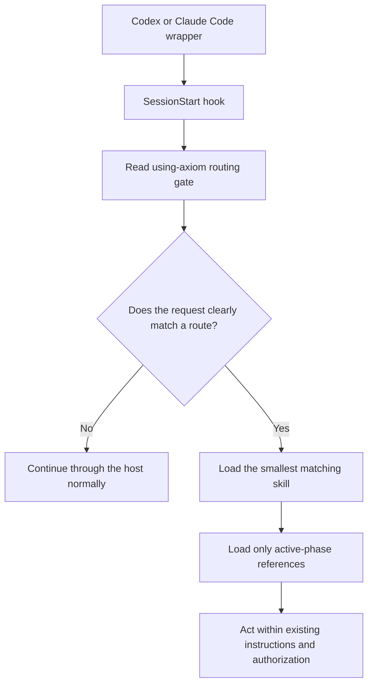

# Architecture

Axiom is a foreground routing layer made of checked-in plugin metadata,
platform hooks, Markdown skills, and on-demand references. It has no daemon,
network service, watcher, automatic updater, or hidden persistent component.

## 1. Platform Wrappers

The wrappers describe the same plugin to two hosts while keeping host-specific
interfaces separate.

| Host | Marketplace | Manifest | Hook definition |
| --- | --- | --- | --- |
| Codex | `.agents/plugins/marketplace.json` | `.codex-plugin/plugin.json` | `hooks/codex-hooks.json` |
| Claude Code | `.claude-plugin/marketplace.json` | `.claude-plugin/plugin.json` | `hooks/claude-hooks.json` |

Both manifests declare `./skills/`. There is one checked-in skill tree, not a
copied Codex tree and a copied Claude Code tree. The distribution drift guard
compares that tree with both manifests, both marketplace wrappers, and the
README shared-skill list.

## 2. Session And Compaction Hooks

The hooks expose the routing gate to the active host session. They do not
select a task route themselves.

| Host event | Checked-in matcher | Action |
| --- | --- | --- |
| Codex `SessionStart` | `startup`, `resume`, `clear`, `compact` | Print a short loading message and read the routing gate from `PLUGIN_ROOT` |
| Claude Code `SessionStart` | `startup`, `resume`, `clear`, `compact` | Print a short loading message and read the routing gate from `CLAUDE_PLUGIN_ROOT` |

Claude Code emits the `compact` `SessionStart` source after either manual or
automatic compaction and adds successful `SessionStart` stdout to model
context. Axiom therefore uses that one post-compaction path and declares no
`PreCompact` handler; ordinary successful stdout from `PreCompact` is not a
context-injection path.

The exact commands are published for independent review in
[README: Inspect The Hooks](../README.md#inspect-the-hooks). Each invocation is
a bounded foreground command. No hook writes a file, contacts a network
service, launches background work, or performs an update.

## 3. `using-axiom` Routing Gate

`skills/using-axiom/SKILL.md` is the front door. Its decision sequence is:

1. Apply higher-priority system, developer, user, and repository instructions.
2. Determine whether the user explicitly invoked Axiom or the request clearly
   matches a bundled skill description.
3. Select the smallest matching skill set and avoid reading candidate bodies.
4. Normalize an unambiguous non-English request to the canonical English route,
   or ask one concise question when multiple routes remain plausible.
5. Continue normally when no Axiom route applies.

The gate is intentionally narrow. General AI work, coding, documentation, and
plugin-maintenance similarity do not make a request an Axiom task.

### Packaged Agent-Plugin Architecture

Version 0.8.0 implements `agent-plugin-architect` for explicit packaged Codex
or Claude Code plugin architecture across shared Skills, route ownership,
manifests, marketplace wrappers, hooks, and version-bound compatibility
evidence. Its accepted ownership, case, schema, and stop contract remains in
[Agent Plugin Architect Route Contract](agent-plugin-architect-route-contract.md).

The route does not own repository-local `AGENTS.md` or `.agents/skills`
systems, ordinary plugin source code or documentation, Git submission,
installation, publication, deployment, or external actions. It uses one shared
Skill tree, adds no startup hook, and keeps historical schemas, benchmarks, and
results byte-identical while current contracts advance additively.

## 4. Task Skills And On-Demand References

The selected task skill establishes its own phase and evidence contract. Every
supporting reference is directly discoverable from its parent `SKILL.md`:

- `agents-architect` performs only the metadata inventory needed to select one
  direct audit, initialization, design, migration, maintenance, runtime, or
  validation route.
- `agent-plugin-architect` inventories a packaged plugin, then loads only the
  directly linked architecture, route, trust, cross-host, evidence, or
  validation reference needed for the active phase. It does not duplicate
  Skills per host or infer host behavior from package shape.
- `optimize-codex-usage` keeps conceptual answers in its main Skill and loads
  one context-audit reference only for measurement or implementation. It uses
  host metrics when exposed and otherwise labels size and call counts as
  proxies.
- `review-axiom-task` freezes a retrospective window at the triggering request,
  separates Axiom guidance from host-agent actions, and labels material evidence
  as observed, reconstructed, or unavailable without persisting a trace.
- `confirm-external-action` freezes an actor, target, payload, disclosure,
  cost, count, and retry envelope before one authorized external effect, then
  verifies the result through the owning external system.
- `traceable-git-submit` separates direct history-preserving submission from
  checkpoint, baseline, consolidation, one-final submission, and recovery
  chains. Direct push loads only repository/target guidance and creates no
  Axiom metadata.
- `reversible-system-change` loads preflight and rollback guidance for plans,
  non-mutating rehearsals, and separately authorized isolated restore
  rehearsals. It adds the execution reference only for a complete authorized
  change, promotion, rollback, or completion claim.

This keeps unrelated workflow instructions out of the active context. A child
route may narrow permissions or add checks; it cannot broaden authorization or
weaken a parent prohibition.

## 5. Execution Remains Host-Native

After a route is selected, the active Codex or Claude Code agent continues to
use the host's normal tools, instruction hierarchy, and approval boundaries.
Axiom does not add an execution service or bypass host controls.

Route selection and action authorization are separate decisions. A loaded
workflow can require more evidence or stop conditions, but it cannot create
permission to edit, commit, push, read credentials, mutate a remote target,
delete data, or promote a version. A task review may describe earlier actions;
it cannot rerun them or turn current state into proof of past authorization.
See the [Trust Model](trust-model.md).

## 6. No-Match Continuation

When no skill clearly applies, `using-axiom` tells the agent to continue
normally without mentioning Axiom. That path is a first-class outcome, not a
fallback error. It keeps ordinary source edits, tests, explanations, status
queries, and local Git staging or commits in the host's normal workflow.

## Lifecycle And Updates

Axiom has no long-running state manager or updater of its own. The host loads
the installed snapshot at its configured lifecycle events and controls how that
snapshot changes. A refresh may be manually requested, or Claude Code may
refresh a marketplace and update installed plugins on disk after startup when
auto-update is enabled. The running Claude Code session keeps the version it
loaded at launch until plugins are reloaded or a new session starts. In every
case, review any changed hook before trusting the new snapshot. See
[README: Updating](../README.md#updating) for the host-specific lifecycle.

For the checked-in support boundary and evidence categories, see
[Compatibility](compatibility.md).
