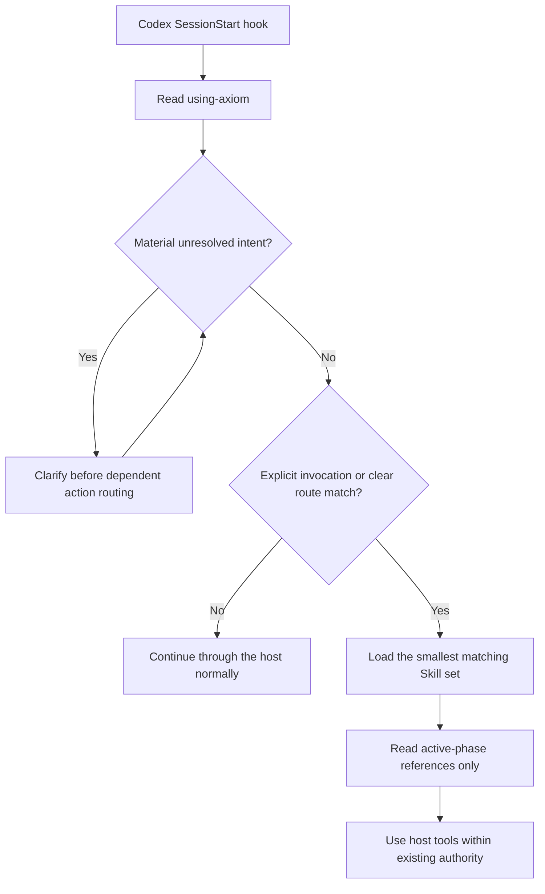

# Architecture

Axiom is a foreground routing layer built from Codex plugin metadata, startup
hooks, Markdown Skills, and on-demand references. After routing, Codex uses its
normal tools and permissions. Axiom adds no execution service, daemon, watcher,
automatic updater, or hidden persistent component.

```mermaid
flowchart TD
    A["Codex SessionStart hook"] --> B["Read using-axiom"]
    B --> C{"Material unresolved intent?"}
    C -- "Yes" --> D["Clarify before dependent action routing"]
    D --> C
    C -- "No" --> E{"Explicit invocation or clear route match?"}
    E -- "No" --> F["Continue through the host normally"]
    E -- "Yes" --> G["Load the smallest matching Skill set"]
    G --> H["Read active-phase references only"]
    H --> I["Use host tools within existing authority"]
```

## Package And Hook

| Source | Responsibility |
| --- | --- |
| [Codex manifest](../.codex-plugin/plugin.json) | Plugin identity, `./skills/`, and explicit hook path |
| [Marketplace descriptor](../.agents/plugins/marketplace.json) | Installation and catalog metadata for this repository root |
| [Hook definition](../hooks/codex-hooks.json) | `SessionStart` handler for `startup`, `resume`, `clear`, and `compact` |
| [Routing gate](../skills/using-axiom/SKILL.md) | Request matching, route ownership, composition, and no-match continuation |
| [Packaged Skills](../skills/) | Direct public entries with parent-owned references and optional agent metadata |

The hook prints a loading message and reads the gate using the host-provided
plugin root. Its bounded foreground command performs no writes, network
requests, background launches, or updates. It exposes instructions; it does not
select a task route or authorize an action. The
[Hook Reference](reference/hooks.md) renders the exact declarations and Windows
wrapper for comparison with the installed definition.

## Route Selection

The gate honors the active instruction hierarchy, then matches explicit
invocations or clear bundled descriptions. It normalizes unambiguous
non-English wording to canonical routes without introducing localized aliases.
Material ambiguity is resolved before action routing; tentative wording alone
does not require a question. Useful, host-supported delegation is assessed only
after the intended result is clear.

Selection precedes reading candidate Skill bodies. Load the smallest matching
set and only the references required for the active phase. Ordinary code or
documentation does not become an architecture workflow merely because its
repository contains a plugin.

Reassess when a later tool choice initiates research from a local or uncertain
execution location, including a fallback from cloud search. Select
`local-web-search` before access; routing itself sends no network request.

## Workflow Ownership

The [Skill sources](../skills/) and [routing gate](../skills/using-axiom/SKILL.md)
are canonical. This table summarizes responsibilities; concrete requests and
controls are in [Examples](examples.md).

| Route | Responsibility |
| --- | --- |
| `clarify-intent` | Resolve material ambiguity with a focused question, plausible options, and a custom answer |
| `delegate-simple-task` | Assign clear bounded work using user-ordered model candidates while preserving the main model and host restrictions |
| `task-planning` | Create or revise general task plans while preserving specialized planning ownership |
| `local-web-search` | Constrain local research, machine-information disclosure, browsing sequence, and challenged-site handoff |
| `agents-architect` | Maintain repo-local `AGENTS.md`, `.agents/` guidance, and local Skills |
| `agent-plugin-architect` | Design or audit packaged plugin architecture and read-only release readiness |
| `optimize-codex-usage` | Reduce or diagnose Codex usage without weakening required quality or safety |
| `review-axiom-task` | Review scoped observable task evidence without rerunning the task or exposing hidden reasoning |
| `confirm-external-action` | Bind, authorize, execute once, and verify a consequential external effect |
| `traceable-git-submit` | Handle checkpoints, baselines, consolidation, recovery, combined commit/tag/push of prepared plugin releases, and explicitly traceable or hardened Git submission |
| `reversible-system-change` | Plan, rehearse, or execute persistent changes with verified recovery and completion boundaries |

`agent-plugin-architect` can design another project's Codex or Claude Code
plugin. Axiom itself supports Codex only. The
[route contract](agent-plugin-architect-route-contract.md) explains the boundary.

## Composition And Phase Changes

Composition follows the gate's ownership rules, not a precautionary load of
every related Skill. A persistent deployment or migration with a consequential
external effect selects both `reversible-system-change` and
`confirm-external-action`. Each keeps its own authority and verification gates.
Publishing an already-prepared artifact alone selects the external-action owner.

Machine-credential work uses one shared
[lifecycle reference](../skills/using-axiom/references/credential-lifecycle.md).
Metadata inventory and persistent consumer activation belong to the reversible
owner; provider creation, revocation, and disclosure belong to the external
owner. An end-to-end rotation needs both. Generic authentication help and human
login do not create another route.

After resume or compaction, active routes are reselected from direct evidence
before new mutation. Each owner's handoff contract determines how interrupted
attempts are reconstructed. Route selection, prior assistant prose, and tool
availability never supply missing authorization.

## No-Match Continuation And Trust

Ordinary source edits, tests, explanations, status queries, local staging or
commits, and named-remote non-force pushes stay host-native unless a specific
description matches. No match is a normal result, not a denial or evidence of a
repository conflict. Active instructions and user authority still govern the
work. See the [Trust Model](trust-model.md).

## Identity, Lifecycle, And Evidence

[Runtime and Repository Identity](runtime-identity.md) separates installed
behavior from repository policy. Documentation or CI changes do not require an
installed release when the final classified runtime inputs remain unchanged.

Codex owns installation and refresh. After changing the installed snapshot,
start a new session and review its hook again; follow
[Managing an Installation](guides/managing-installation.md). Static package
validation and native command tests do not establish fresh installed-plugin or
model-session behavior. [Compatibility](compatibility.md) owns the current
support and observation boundary.
